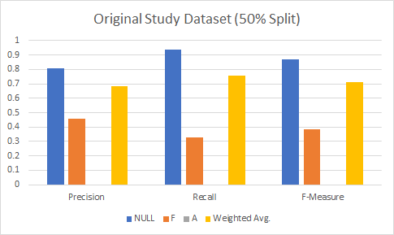
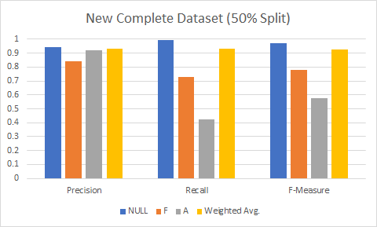

# Requirements-Collector Enhancement: Combining ML and DL Pipelines and Extending the Dataset
Requirements-Collector follow-up study: Automating Requirements Specification from Elicitation Sessions and User Feedback\
Tool - Version 1.1

**Authors:** [Christian Aeberhard](https://github.com/niddhog), [Marc Kramer](https://github.com/Makram95), [Janik Lüchinger](https://github.com/jluech), [Tanzil K Mohammed](https://github.com/tanzilkm)

## Overview
1. [Our Work](#section1)
2. [Requirement Collector Tool Description](#section2)
3. [Installation Guide](#section3)
4. [Dataset Description](#section4)\
4.1 [Requirement Dataset](#section4.1)\
4.2 [User Story Dataset](#section4.1)
5. [Wrapper Component Description](#section5)
6. [Study Results and Discussion](#section6)

## 1. Our Work
In order to speed up the time-to-market of high-quality software products, the authors developed the _Requirements-Collector_ tool.
This tool supports an automatic analysis and classification of requirements specification and user feedback by leveraging the power of machine and deep learning strategies (for a full description of the ML and DL component, please follow the links mentioned in the [Tool Description](#section2) section).
Related studies pointed out that the lack of data from requirement elicitation sessions is an obstacle in this type of investigation.
Thus, this study focuses on extending the requirements and user story dataset of the former study in contemplation of further validating the efficiency and precision of the _Requirements-Collector_ tool.
Additionally, to further increase the usability of the tool and to allow a broader audience to interact with it, we developed a more flexible environment: _StoryTeller_, including a dedicated graphical user interface.

_StoryTeller_ acts as a wrapper and combines both the ML and DL component inside a single executable instance.
The newly created and labeled data sets have been applied to both the ML and DL Pipeline in order to further train the algorithms and evaluate their resulting precision and accuracy values.

## 2. Requirement-Collector Tool Description
The **Machine Learning (ML)** and **Deep Learning (DL)** components used in this study are based on the _Requirements-Collector_ tool [1] as proposed by [Sebastiano Panichella](https://spanichella.github.io/index.html) and [Marcela Ruiz](https://www.marcelaruiz.eu/).
The corresponding installation guide and source code of both ML and DL component can be found in the following links to their respective GitHub repositories:

- [ML-Component](https://github.com/spanichella/Requirement-Collector-ML-Component)
- [DL-Component](https://github.com/lmruizcar/Requirements-Collector-DL-Component)

**Requirements-Collector Context:**

## 3. Setup Guide
### Pre-Requisites
- Java 15
- The [R language](https://cran.r-project.org/) (version 4.0.3) must be installed and operational 
- Cores: 8
- Memory: 4.9 GB
- Download [glove txt file](https://www.kaggle.com/watts2/glove6b50dtxt) and put it into the DL folder located at Combined Project -> Ressources
- For usage on Windows, add the RScript bin folder path (e.g., C:\Program Files\R\R-4.0.3\bin) to the PATH variable (in environment variables)

Hint: It can potentially help to install [RStudio](https://rstudio.com/products/rstudio/download/), where you can manually open and execute the [MainScript.r]("./combined-pipelines/resources/R-scripts/MainScript.r") step by step as to install and load the necessary R packages.

### Supported Operating Systems
- Mac OS (works on 10.15.7 using Intel chipset)
- Ubuntu 18.04 or above
- Windows 10

## 4. Dataset Description
For evaluation of the DL and ML component, we created a new dataset based on a requirement elicitation session and used it to extend the already existing dataset of the original study.
The resulting complete dataset (see [datasets folder](./datasets)) achieved better performance, as is discussed in section [Study Results](#section6).

### 4.1 Recording Dataset
The requirements dataset was generated completely from scratch by recording an elicitation meeting, transcribing the test by applying a voice-to-text transformation, and finally manually labeling the data. In order to ensure anonymity, the company name as well as the project name have been anonymized and do not represent real names.

#### Meeting Context and Objective
- **Meeting Environment:** The meeting was held in a remote fashion using [Microsoft Teams](https://www.microsoft.com/de-ch/microsoft-365/microsoft-teams/group-chat-software) as a conferencing tool.
- **Meeting Setup:** The meeting included three participants: a UX designer, a software engineer, and the project manager.
- **Meeting Topic:** The topic of the meeting was set around the _ABC Software_ project.
    The _ABC Software_ (SaaS) is a web based survey tool that supports team managers and project managers in creating short surveys (Pulse Surveys) with little effort and an intuitive and an easy to understand interface.
    A Pulse Survey typically takes around 2 - 3 minutes for a survey participant to fill out.
    Pulse Surveys allow managers to "feel the pulse" of their team, may it be on the topic of "work satisfaction", "motivation", or "engagement".
    The project is still in a very early stage, thus the meeting was planned in the course of a series of kick-off meetings where the manager needed UX and technical inputs on a set of different functionalities which the ABC software should include.
    There are currently 5 software developers, 2 designers, 2 slicers and 1 UX designer as well as management (consisting of 2 people) working on this project, and it is set to launch in Summer 2020 with the initial phase 1.0 requirements satisfied.
    It is worth mentioning that the ABC Company acts as a customer in this project and has developed a paper prototype of how the _ABC Software_ should work.
    The actual development is done by an outsourcing software development company located in Russia.
    Thus, the meeting was purely aimed at eliciting requirements of the software in order to discuss them later on with the outsourcing company.
- **ABC Company Description:** The ABC Software Project was launched by the ABC Company, an innovative market research company and leader in employee surveys, 360° leadership feedback and supervisor evaluation throughout Switzerland.
    The company consists of 12 Employees, was founded in 2002 and has over 20 years of expertise in the field in market and company analysis.
    Based on well-founded study concepts as well as quick, user-friendly survey and meaningful reporting, the company offers a broad variety of products in the field of employee satisfaction, customer satisfaction, and leadership feedback.

#### Dataset Information
- The dataset can be found in the repository and is named [truth_set_recording-ReqSpec.txt](./datasets/recording/truth_set_recording-ReqSpec.txt)
- The dataset was labeled using the following coding conventions:
    - **F**: Functional Requirement
    - **A**: Non-Functional Requirement (quality requirement)
    - **NULL**: Neither functional nor non-functional
- The dataset contains 665 lines of labeled lines of tab-separated values, including line number, text content, and classification label
- Strong semantic errors in the transcription due to misspelling or mis-identification of words have been manually fixed

#### Dataset Creation
- We collected the software specifications of the project and derived some project requirements
- We recreated an elicitation session with three participants as described above
- Then we converted the recording to text using a dedicated speech-to-text conversion tool.
    Specifically, we used [rev.com](https://www.rev.com/), an online tool to convert speech to text
- Finally, we received a raw text file from the online tool for which we then had to label each sentence according to the labels described above

### 4.2 User Stories Dataset
The user story dataset was created using a [collection of datasets](https://data.mendeley.com/datasets/7zbk8zsd8y/1) of 50+ requirements each - expressed as user stories - and combining them with randomly selected `NULL` lines from the existing dataset in the original study.

#### Dataset Information
- The dataset can be found in the corresponding dataset folder as [truth_set_stories-ReqSpec.txt](./datasets/stories/truth_set_stories-ReqSpec.txt)
- The dataset contains 1215 lines of labeled lines of tab-separated values, including line number, text content, and classification label
 
#### Dataset Creation
- From existing datasets (mentioned above) containing different files of user stories we collected 615 lines of requirements (files g02-04, g08, g10-14; contained in the [sources folder](./datasets/_sources/datasets))
- We manually labeled the dataset as Functional Requirement (`F`) or Non-Functional Requirement (`A`)
- In order to balance the dataset we added 600 `NULL` lines by randomly selecting matching lines from the dataset [truth_set_study-ReqSpec.txt](./datasets/study/truth_set_study-ReqSpec.txt) of the previous work.
    We used [Microsoft Excel](https://www.microsoft.com/en-ww/microsoft-365/excel) for this by sorting the dataset according to the classifications and shuffling the lines using [random sort in Excel](https://www.ablebits.com/office-addins-blog/2018/01/24/excel-randomize-list-random-sort/).
    We then combined the findings with our gathered user stories and shuffled the dataset again for its final version

## 5. Wrapper Component Description
During our project, we wrapped the two pipelines into one executable program.
To make it more user-friendly, we changed the setup and execution procedure from ground up:
We removed the command-line interaction as well as any manual specifications of local paths, and replaced them with a simple graphical user interface instead.
While merging the pipelines we also refactored, cleaned up, and fixed the code, such that it now also works on Windows.
A more in-depth description of the changes and the code in general, as well as possible future improvements can be found in the specific code README [here](combined-pipelines/README.md).

## 6. Study Results and Discussion
- **Precision** is a metric which quantifies the number of correct positive predictions made and is calculated as the ratio of correctly predicted positive examples (out of the total retrieved) divided by the total number of retrieved examples [2]
- **Recall** is a metric which quantifies the number of correct positive predictions made out of all positive predictions there are. Recall provides an indication of missed positive predictions (contrary to precision) [2]

###  Discussion of Precision and Recall From ML Pipeline 
**Original Study Dataset Precision and Recall Result:**\
\

**New Complete Study Dataset Precision and Recall Result  :**\
\

**Compare Original Study Dataset Vs New Complete Study Dataset (Precision and Recall ) :**\
\

## References
- [1] M. Ruiz, S. Panichella, 2020. Can We Design Software as We Talk?
- [2] A. Fernandez, S. Garcia, M. Galar, R. C. Prati, B. Krawczyk, F. Herrera, 2018. Learning from Imbalanced Data Sets, 1st ed. 2018 Edition
